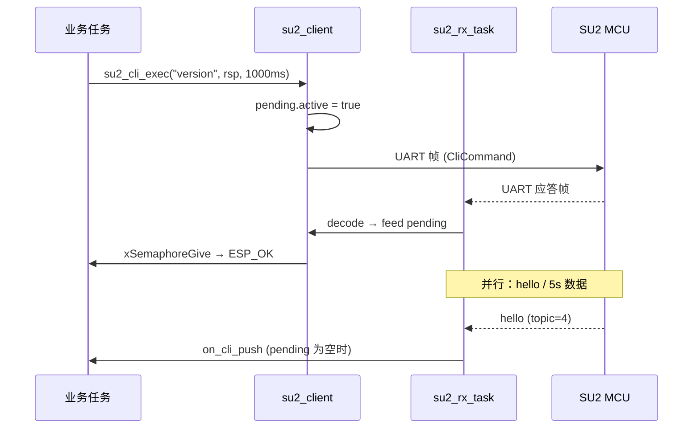

# SU2 通信架构设计说明

> 本文档描述**新工程**中与 SU2 传感器 MCU 通信的软件架构，面向 ESP32 等主控侧实现。  
> 设计目标：协议对齐《双床协议》4.1.3（`CliCommand` / topic=4），与现有 `ESP_BC` 工程中的 `set_bc` / `pause_uart_task` 实现**无兼容关系**。

---

## 1. 背景与目标

### 1.1 业务场景

主控（ESP32）通过 UART 连接 SU2 睡眠传感器模块，需要完成：

| 类型 | 示例 | 特征 |
|------|------|------|
| 同步指令 | `version`、`set mode 4`、`get rtc` | 发一条命令，等待一条（或少量）文本应答 |
| 多帧同步指令 | `list` | 应答为多行文本，UART 上拆成多帧返回 |
| 异步只发不等 | `report 0` | 下发后由传感器按 topic 5/6/7… 持续推送报告数据 |
| 被动上报 | `hello`（100ms）、`list updata`、5s/1min 实时数据 | 无对应下发，随时到达 |

### 1.2 旧实现的主要问题（新工程需避免）

现有 `ESP_BC` 中 `set_bc()` 的典型做法：

- 用 `pause_uart_task` 暂停后台收包任务，再 `uart_flush` + 阻塞 `uart_read_bytes` 抢应答。
- 下发 payload 使用 `state_raw_data` 编码，与协议文档中的 `CliCommand` 不一致。
- `list` 通过 `strstr(value, "list")` 走特殊分支，易误匹配 `list updata`。
- `switch_to_aliyun` 等参数未在 UART 层落地，职责边界模糊。

新架构的核心原则：

1. **单一 RX 路径**：串口只由一个任务读取，永不全局 pause。  
2. **分层解耦**：帧 / 协议 / 事务 / 业务 四层分离。  
3. **协议标准化**：CLI 下发与应答统一 `qs_pb_msg_cli_command`（topic id = 4）。  
4. **显式事务**：同步命令用 pending 事务 + 信号量，不用 flush 抢总线。

---

## 2. 协议分层模型

通信在逻辑上分为四层，自底向上依赖关系如下：

```
┌─────────────────────────────────────────┐
│  业务层 (App / MQTT / BLE / NVS)         │
│  调用 su2_cli_exec / su2_cli_list 等     │
└──────────────────┬──────────────────────┘
                   │
┌──────────────────▼──────────────────────┐
│  事务层 su2_client                       │
│  同步/异步命令、pending、超时、回调分发   │
└──────────────────┬──────────────────────┘
                   │
┌──────────────────▼──────────────────────┐
│  协议层 su2_proto                        │
│  Protobuf: CliCommand / 各 topic 解码    │
└──────────────────┬──────────────────────┘
                   │
┌──────────────────▼──────────────────────┐
│  帧层 su2_frame + su2_crc                │
│  AA55、地址、topic、CRC16、多帧重组       │
└──────────────────┬──────────────────────┘
                   │
┌──────────────────▼──────────────────────┐
│  传输层 UART Driver (ESP-IDF)            │
└─────────────────────────────────────────┘
```

### 2.1 UART 物理帧格式

与《双床协议》及文档示例一致：

| 偏移 | 字段 | 说明 |
|------|------|------|
| 0~1 | `0xAA 0x55` | 帧同步头 |
| 2 | flag | `0x01` 单帧；`0x11` 多帧首；`0x3x` 中间；`0x4x` 尾 |
| 3 | pdu_len | PDU 长度；**整帧字节数 = pdu_len + 8** |
| 4 | src_addr | 源地址（如 `0x34`） |
| 5 | dst_addr | 目的地址（如 `0x37`） |
| 6 | topic | Topic ID，CLI 指令为 **4** |
| 7… | payload | Protobuf 二进制 |
| 末 2 字节 | CRC16 | 覆盖帧除 CRC 外全部字节，低字节在前 |

CRC 算法与现有 `crc16_compute()` 相同（Modbus 风格多项迭代）。

### 2.2 应用层 CLI 指令（topic = 4）

Protobuf 消息（`keesoncloud.proto` → `CliCommand`）：

| 字段 | 类型 | 说明 |
|------|------|------|
| deviceID | string(24) | 如 `SU20000001` |
| timestamp | int32 | UTC 秒 |
| command | string | ASCII 命令，如 `version`、`list`、`set mode 4` |

编码示例（文档）：

```
qs_pb_msg_cli_command m;
strcpy(m.device_id, "SU20000001");
strcpy(m.command, "version");
m.timestamp = 1622234876;
qs_pb_cli_command_encode(&m, buf, &sz);
→ 封装进 AA55 帧，topic=4，再发 UART
```

应答同样在 topic=4 的 `CliCommand.command` 字段中返回文本（如 `ok`、`SU2-1.0.0,Board:1.0`、多行 `list` 结果）。

### 2.3 其他 Topic（异步数据流）

| Topic | 宏 / 数值 | 用途 |
|-------|-----------|------|
| 5 | 睡眠周期 / 报告基础 | `report` 流程 |
| 6 | 睡眠分期 raw | 长数据 |
| 7~12 | 心率、呼吸、体动、打鼾、血压等 | 报告分包 |
| 13~15 | 5s / 1min / 呼吸暂停事件 | 实时数据 |

这些帧**不进入同步事务**，由 `on_topic` 回调交给业务层（例如组 JSON 上云）。

---

## 3. 软件模块划分

推荐组件目录：`components/su2/`

```
components/su2/
├── include/
│   ├── su2_types.h      # 公共类型、配置、回调
│   ├── su2_frame.h      # 帧编解码、CRC、多帧重组
│   ├── su2_proto.h      # Protobuf 封装
│   └── su2_client.h     # 对外 API（业务唯一入口）
├── su2_crc.c
├── su2_frame.c
├── su2_proto.c
└── su2_client.c         # RX 任务 + 事务 + 分发
```

### 3.1 模块职责

| 模块 | 职责 | 不应包含 |
|------|------|----------|
| `su2_crc` | CRC16 计算 | 业务逻辑 |
| `su2_frame` | 组帧、切帧、CRC 校验、多帧 `su2_mf_asm` | Protobuf、FreeRTOS 事务 |
| `su2_proto` | `CliCommand` 及び各 topic 的 encode/decode | UART IO |
| `su2_client` | RX 任务、环形缓冲、pending 事务、API | MQTT、NVS 等 |

业务工程中的 WiFi/MQTT/BLE **只依赖 `su2_client.h`**，不直接操作 UART 寄存器或帧格式。

---

## 4. 运行时架构

### 4.1 任务与资源

```
                    ┌─────────────────┐
                    │   su2_rx_task   │  优先级建议 10+
                    │  (唯一读串口)    │
                    └────────┬────────┘
                             │ uart_read_bytes(20ms)
                             ▼
                    ┌─────────────────┐
                    │  ring buffer    │  4KB，粘包/半包
                    └────────┬────────┘
                             │ su2_frame_try_parse
                             ▼
              ┌──────────────┴──────────────┐
              │                             │
     topic==4 & pending          无 pending 或
              │                  fire-and-forget
              ▼                             ▼
     su2_pending_feed          on_cli_push / on_topic
              │
              ▼
     xSemaphoreGive(done)


  其他任务 ──su2_cli_exec()──► tx_mutex ──► uart_write_bytes
```

| 资源 | 说明 |
|------|------|
| `su2_rx_task` | 循环读 chunk → 写入 ring → 按帧解析 → 分发 |
| `tx_mutex` | 多任务写串口时互斥，避免帧交织 |
| `pending` | 最多一个同步事务（可扩展为队列，初版建议串行） |
| `su2_mf_asm` | 多帧 PDU 拼接缓冲区（list 等） |

**禁止**：为等待应答而停止 `su2_rx_task` 或 `uart_flush` 清空尚未处理的应答帧。

### 4.2 接收路径（RX Pipeline）

```
UART bytes
    → ring buffer（丢弃最旧数据以防溢出）
    → 同步 AA55（跳过无效前缀）
    → CRC 校验失败：丢 1 字节重同步
    → 单帧：直接 payload
    → 多帧：su2_mf_asm_feed 直至 completed
    → su2_proto_decode_cli（topic=4）
    → 分发（见 4.3）
```

### 4.3 分发策略

```
                    ┌──────────────────┐
                    │  解析得到帧       │
                    │  topic + payload │
                    └────────┬─────────┘
                             │
              ┌──────────────┼──────────────┐
              │              │              │
        pending.active   topic==4      topic!=4
        && topic==4      无 pending
              │              │              │
              ▼              ▼              ▼
        拼接到 pending    on_cli_push    on_topic
        缓冲区            (hello等)      (5/7/13...)
              │
    ┌─────────┴─────────┐
    │                   │
 SINGLE              MULTIFRAME
 收到即完成          空闲超时完成
 give(done)         give(done)
```

**被动 CLI（topic=4，无 pending）**

- `hello` → 回调里可链式 `set addr 3`、`set mode 4`。  
- `list updata` → 回调里触发「拉 list → 选 report → 上云」状态机。

**同步 CLI（有 pending）**

- 应答文本写入 `pending.buf`，由调用方传入的 `rsp` 缓冲区接收。  
- `SU2_RESP_SINGLE`：解码到第一条合法 CLI 应答即 `ESP_OK`。  
- `SU2_RESP_MULTIFRAME`：持续拼接，直到 **RX 空闲超过 T_idle（如 80ms）** 认为 `list` 结束。

**report 流（`SU2_RESP_FIRE_FORGET`）**

- 下发 `report N` 后不等待 CLI 文本。  
- topic 5~12 帧全部由 `on_topic` 处理，直至业务层判定报告接收完成。

---

## 5. 事务层设计（下发与响应）

### 5.1 命令分类

| 枚举 `su2_resp_kind_t` | 命令示例 | API | 超时建议 |
|------------------------|----------|-----|----------|
| `SU2_RESP_SINGLE` | `version`、`set mode 4`、`get mode` | `su2_cli_exec()` | 500~1000 ms |
| `SU2_RESP_MULTIFRAME` | `list` | `su2_cli_list()` | 1500~3000 ms |
| `SU2_RESP_FIRE_FORGET` | `report 0` | `su2_cli_fire_and_forget()` | 无（不等 CLI 文本） |

分类由命令字符串决定（`strcmp` / `strncmp`），**不使用** `strstr("list")` 模糊匹配。

### 5.2 同步事务状态时序



### 5.3 `list` 多帧应答

传感器将多行列表拆成多个 UART 帧（单帧或多帧 flag 序列）。软件侧：

1. 每个完整 PDU 解码后，将 `command` 字段**字符串拼接**到 `rsp`。  
2. 帧间若短暂无数据，用 **idle timeout** 判定结束（而非固定帧数）。  
3. 业务层按 `\n` 分行解析索引与时间（与协议文档示例一致）。

### 5.4 并发规则

| 规则 | 说明 |
|------|------|
| 单事务 | 同一时刻仅允许一个 `pending`；第二个 `su2_cli_exec` 返回 `ESP_ERR_INVALID_STATE` |
| 复杂流程 | 用应用层状态机串行：`list` → 解析 → `report N` → 收齐 topic 流 → 上云 |
| TX 互斥 | 写 UART 必须持有 `tx_mutex` |

---

## 6. 对外 API 概要

```c
/* 初始化：UART 引脚、波特率、设备 ID、总线地址 */
esp_err_t su2_client_init(const su2_config_t *cfg, uart_port_t port, ...);

/* 注册被动回调 */
void su2_client_set_handlers(const su2_handlers_t *h);

/* 同步短命令 */
esp_err_t su2_cli_exec(const char *command, char *rsp, size_t rsp_cap, uint32_t timeout_ms);

/* 同步 list */
esp_err_t su2_cli_list(char *rsp, size_t rsp_cap, uint32_t timeout_ms);

/* 只发不等（report 流） */
esp_err_t su2_cli_fire_and_forget(const char *command);
```

返回值：

| 返回值 | 含义 |
|--------|------|
| `ESP_OK` | 同步命令在超时内收到完整应答 |
| `ESP_ERR_TIMEOUT` | 超时未收齐 |
| `ESP_ERR_INVALID_STATE` | 已有事务进行中 |
| `ESP_FAIL` | 编码失败或 CRC/解码错误 |

---

## 7. 与业务层的边界

```
┌─────────────────────────────────────────────────────────┐
│ 应用 (main / use_wifi / 睡眠报告状态机)                  │
│  - 上电：等待 hello → set addr / set mode                 │
│  - 定时：list → 比对 NVS → report → MQTT publish         │
│  - OTA：set mode 3 → 专用升级协议（可独立组件）           │
└───────────────────────────┬─────────────────────────────┘
                            │ 仅 su2_client.h
┌───────────────────────────▼─────────────────────────────┐
│ components/su2                                           │
└───────────────────────────┬─────────────────────────────┘
                            │
┌───────────────────────────▼─────────────────────────────┐
│ components/protobuf (keesoncloud.proto / qs_protobuf)    │
└─────────────────────────────────────────────────────────┘
```

**不应放入 `su2_client` 的内容：**

- MQTT topic、JSON 格式、阿里云规则  
- NVS 报告列表持久化  
- `switch_to_aliyun` 一类产品逻辑  

这些在收到 `su2_cli_list` 结果或 `on_topic` 数据后，由上层模块处理。

---

## 8. 典型业务流程

### 8.1 上电初始化

```
SU2 上电
  → 每 100ms 发 hello (topic=4)
  → on_cli_push("hello")
       → su2_cli_exec("set addr 3")
       → su2_cli_exec("set mode 4")
  → su2_cli_exec("get devid" / "version")  // 可选
  → su2_cli_exec("set rtc <utc>")         // 对时
```

### 8.2 睡眠报告上云

```
su2_cli_list(list_buf)
  → 解析每行：索引、日期、时间、编号
  → 与 NVS 中已上报记录比对
  → 对未上报项：su2_cli_fire_and_forget("report N")
  → on_topic(5..12) 组包
  → MQTT publish
  → 更新 NVS
```

### 8.3 新报告通知

```
on_cli_push("list updata 7 2021-08-25 ...")
  → 触发与 8.2 相同的子集同步
```

---

## 9. 与 ESP_BC 旧架构对照

| 维度 | ESP_BC (`set_bc`) | 新架构 (`su2_client`) |
|------|-------------------|------------------------|
| 下发编码 | `state_raw_data` + 手工 4 字节头 | `CliCommand` |
| 应答解码 | 多为 `state_raw_data_decode` | `CliCommand`（list 若实测为 topic6 可增加适配层） |
| 串口读 | pause + flush + 阻塞读 | 单 RX 任务 + ring |
| 同步机制 | 全局 `pause_uart_task` | `pending` + Semaphore |
| list | `strstr` + `report_muilt_cmd_parse` | `SU2_RESP_MULTIFRAME` + idle 收尾 |
| report | `switch_return=0` 混在 set_bc | `fire_and_forget` + `on_topic` |
| 可测试性 | 与 3400 行 app_control 耦合 | 组件独立，可 mock UART |

---

## 10. 扩展与调优

### 10.1 实机差异适配

若 `list` 应答在实机上为 **topic=6 `StateRawData`** 而非 topic=4：

- 在 `su2_pending_on_complete_pb()` 增加分支即可；  
- **帧层与 RX 任务无需改动**。

### 10.2 参数调优表

| 参数 | 默认值 | 调优场景 |
|------|--------|----------|
| `SU2_RING_SIZE` | 4096 | 高速 burst 可加大 |
| list idle timeout | 80 ms | 列表很长 → 150~200 ms |
| `su2_cli_list` timeout | 2000 ms | 报告条数多 → 3000 ms |
| RX task 栈 | 4096 | 深回调链 → 6144 |

### 10.3 后续可增强

- 事务队列（支持排队，仍串口串行发送）  
- 请求 `seq` 字段（若固件未来支持）  
- 统计：CRC 错误率、超时次数、帧同步丢失计数  
- 单元测试：帧编解码 golden vector（复用协议文档 hex 样例）

---

## 11. 依赖与构建

```
components/su2  →  REQUIRES: driver, freertos, protobuf
```

Protobuf 源文件：`components/protobuf/keesoncloud.proto`，生成或复用现有 `qs_protobuf.c`。

---

## 12. 参考文档

- 项目内：《双床协议.md》§4.1.2 Topic ID、§4.1.3 指令定义  
- Proto：`components/protobuf/keesoncloud.proto` → `CliCommand`  
- 旧实现（仅供对比）：`components/app_control/app_control.c` → `set_bc`、`uart_data_parser_task`

---

## 修订记录

| 版本 | 日期 | 说明 |
|------|------|------|
| 1.0 | 2026-05-20 | 初版：新工程 SU2 通信架构 |
